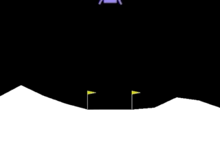

# DDQN Lunar Lander

## Introduction
The goal of this project is to earn more than +200 reward on average over 100 trials in the game [Lunar Lander](https://gym.openai.com/envs/LunarLander-v2/). To tackle this challenge, a Double Deep Q-Network (DDQN) is introduced and implemented with a detailed explanation.

## Lunar Lander
<p align="center"></p>
<p align="center">(https://gym.openai.com/envs/LunarLander-v2/)</p>

Lunar Lander of OpenAI Gym (Brockman et al. 2016) is an interactive environment for an agent to land a rocket on a planet. A state here can be represented by an 8-dimensional continuous space:  

$$ (x, y, v_{x}, v_{y}, v_{\theta}, leg_{left}, leg_{right}) $$  

, where $x$ and $y$ are the coordinates of the lander's position; $v_{x}$ and $v_{y}$ are the velocity components on two axes; $\theta$ and $v_{\theta}$ are the angle and the angular velocity separately; $leg_{left}$ and $leg_{right}$ are two binary values standing for whether the left or right leg of the lander is touching the ground.

For each time step, there are four discrete actions available, that is, doing nothing, firing the left orientation engine, firing the main engine, and firing the right orientation engine.

The game will be over or passed if the lander crashes or comes to rest. The reward for a bad ending is -100, while that for a happy ending is +100. The touching of the leg to the ground can generate a +10 reward, but each time of firing the main engine incurs a -0.3 penalty. Therefore, the total reward for a single episode ranges from 100 to more than 200 based on the final location of the lander on the pad. The distance between the landing pad and the lander will cause a penalization, which equals to the reward gained by moving closer to the pad. 

In this project, a method will be treated as a successful solution for this game if it is able to achieve more than +200 points average over 100 consecutive episodes.

## Directory
+ **main.py** - to conduct the entire project directly and show some figures
+ **main.ipynb** - to go through the modeling, training, and evaluation step by step
+ **config.py** - to set the configuration for model development and training pipeline
```
DDQN-Lunar-Lander/
├── README.md
├── config.py
├── main.ipynb
├── main.py
├── output
│   ├── ddqn_agent
│   └── random_agent
├── reference
├── requirements.txt
├── res
└── src
    ├── agent.py
    └── model.py
```

## Dependencies
+ python >= 3.7.2
+ jupyter >= 1.0.0
+ numpy>=1.16.2
+ gym >= 0.16.0
+ torch >= 1.4.0
+ tqdm >= 4.43.0

## Setup
Please ensure the following packages are already installed. A virtual environment is recommended.
+ Python (for .py)
+ Jupyter Notebook (for .ipynb)

```
$ cd DDQN-Lunar-Lander/
$ pip3 install pip --upgrade
$ pip3 install -r requirements.txt
```

To generate video record for an episode: 
* On OS X, you can install ffmpeg via `brew install ffmpeg`. 
* On most Ubuntu variants, `sudo apt-get install ffmpeg` should do it. 
* On Ubuntu 14.04, however, you'll need to install avconv with `sudo apt-get install libav-tools`.

## Output
```
Initialize the environment...

Training...
Episode 622 Epsilon 0.09 Reward 255.82 Avg_Reward 201.26 Best_Avg_Reward 199.03:  62%|████████████████████████████████████████████████████████████████████████▋                                            | 621/1000 [28:58<11:28,  1.82s/it]
Save training rewards plot as ~/DDQN-Lunar-Lander/output/ddqn_agent/result_img_0.png.

Evaluating...
Episode 100.00 Reward 266.90: 100%|█████████████████████████████████████████████████████████████████████████████████████████████████████████████████████████████████████████████████████████████████████████| 100/100 [00:53<00:00,  1.88it/s]
Save evaluation rewards plot as ~/DDQN-Lunar-Lander/output/ddqn_agent/result_img_1.png.
Total rewards in a game: 163.29
Save video record to ~/DDQN-Lunar-Lander/output/ddqn_agent.
Done.
```

## Results

### Random Agent
<p align="center"></p>

### DDQN Agent
<p align="center"> </p>
<p align="center"></p>

## Authors
* **[Ning Shi](https://mrshininnnnn.github.io/)** - MrShininnnnn@gmail.com

## Reference
1. Hasselt, H. V. (2010). Double Q-learning. In Advances in neural information processing systems (pp. 2613-2621).
2. Van Hasselt, H., Guez, A., & Silver, D. (2016, March). Deep reinforcement learning with double q-learning. In Thirtieth AAAI conference on artificial intelligence.
3. Brockman, G., Cheung, V., Pettersson, L., Schneider, J., Schulman, J., Tang, J., & Zaremba, W. (2016). Openai gym. arXiv preprint arXiv:1606.01540.